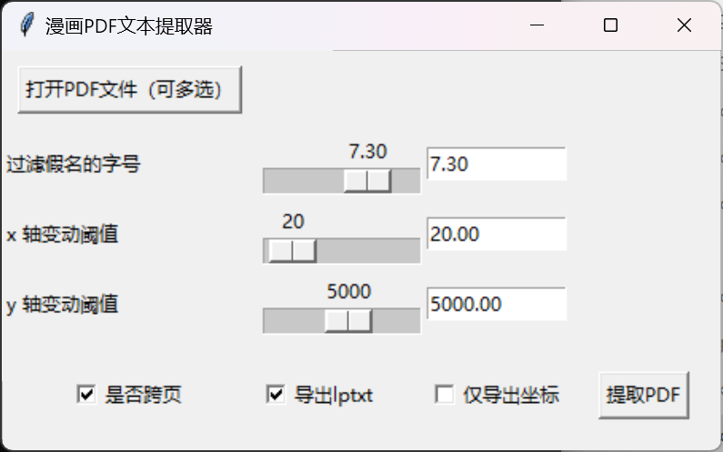
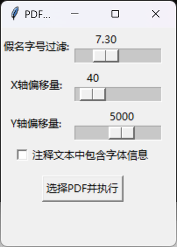
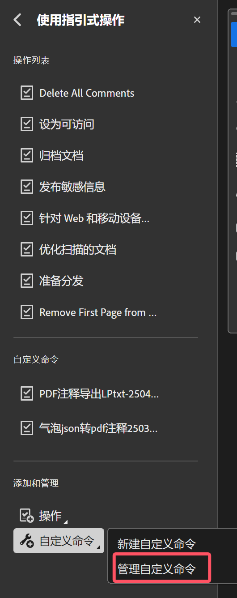

# 漫画PDF脚本仓库

日文漫画PDF处理工具集，支持文本提取、自动注释、翻译等功能。

## 功能介绍

### 1. 日文漫画PDF文字提取器
通过字号字体过滤掉不需要的假名标注，有LP文本和普通文本两种导出模式，支持输入PDF密码。



### 2. PDF自动生成注释
把PDF中的原文右上角添加注释，显示字体字号信息。



### 3. PDF注释导出
Acrobat导出PDF注释内容，加粗部分用【】括号包裹。

### 4. PDF注释导出-info
导出基础上加上注释的作者和主题，配合自动生成注释脚本可以获取原文字体和字号信息，配合导入脚本可实现全自动嵌字。

### 5. 一键合并PDF
批量合并PDF，自动排序。放在PDF文件夹下运行或者运行后选择PDF文件夹。当选择的文件夹内没有PDF的时候合并图片。

### 6. PDF自动翻译（OpenClaw技能）
[pdf-auto-trans](pdf-auto-trans/pdf-auto-trans-cli)是给漫画PDF添加翻译注释的自动化命令行工具，支持多种翻译API。



## 环境配置

### 安装依赖

```bash
pip install -r requirements.txt
```

依赖列表：
- `flask` - Web服务器
- `pdfplumber` - PDF文本提取
- `pymupdf` - PDF处理和操作
- `requests` - HTTP请求
- `pandas` - 数据处理
- `openpyxl` - Excel文件读写
- `pypdf` - PDF合并分割
- `pillow` - 图片处理

### 安装方法

#### Adobe Acrobat Pro（推荐）
1. 在"更多工具"中找到"指引式操作"（旧版本叫"动作向导"）
2. 管理自定义命令
3. 导入XML命令文件或sequ动作文件
4. 打开PDF文件，在动作向导工具中点击命令运行

#### Python脚本
- Windows 10以上版本：exe直接运行
- Mac系统：需配置Python环境

**注意**：Python不能获取注释中加粗的字，建议使用Acrobat Pro JS脚本导出。

## 目录结构

```
manga-PDF-Script/
├── 文本提取/                  # 日文PDF文本提取工具
├── 生成注释/                  # PDF自动生成注释
├── 导出注释/                  # PDF注释导出工具
├── 合并pdf/                   # PDF合并工具
├── BTjson生成注释PDF/         # BTJSON转PDF
├── pdf-auto-trans/           # PDF自动翻译工具
│   └── pdf-auto-trans-cli/   # 命令行工具
├── img/                      # 图片资源
└── requirements.txt          # Python依赖
```
